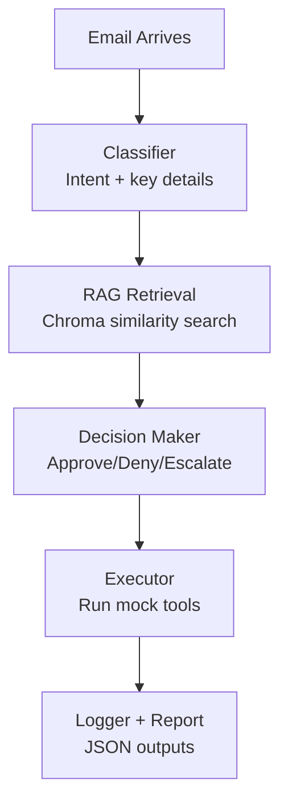

AGENT EMAIL SYSTEM

Overview
An automated email agent that classifies intent, retrieves policy context using RAG with ChromaDB, makes a decision, executes mock tools, and logs results end to end.

Key Capabilities
- Intent classification (refund, support, cancellation, etc.)
- RAG retrieval with ChromaDB for relevant policy context
- Decisioning: approve, deny, escalate
- Tool execution with logging and reporting

Architecture Flow


Project Structure
- agents/
  - email_classifier.py
  - knowledge_retriever.py
  - decision_maker.py
  - executor.py
- data/
  - knowledge_base.py
  - mock_emails.py
- logs/
  - actions.json
- main.py
- test_agent.py
- requirements.txt

How to Run
1) Install dependencies

```powershell
python -m pip install -r requirements.txt
```

2) Run the demo

```powershell
python test_agent.py
```

Outputs
- Summary printed to console
- Report: [final_report.json](final_report.json)
- Demo output: [demo_output.txt](demo_output.txt)
- Logs: [logs/actions.json](logs/actions.json)

Demo Results
- 6/6 emails processed
- Decisions: 5 approve, 1 deny

Sample Report Snippet
```json
{
  "total_emails_processed": 6,
  "successful": 6,
  "failed": 0,
  "decisions": {
    "APPROVE": 5,
    "DENY": 1,
    "ESCALATE": 0
  }
}
```
